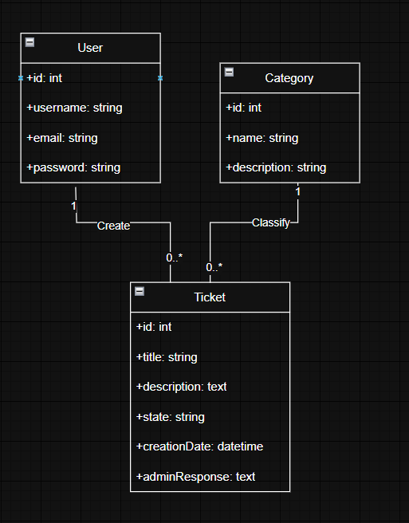
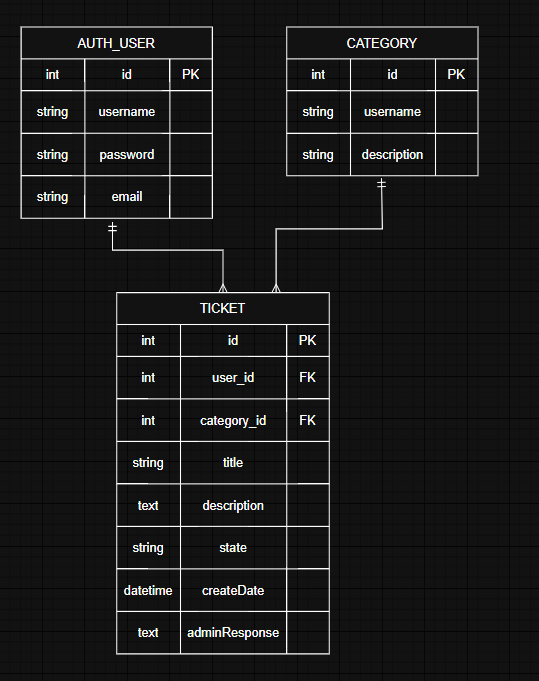
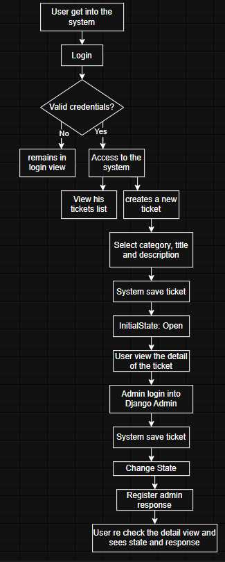

# Documento de Diseño – Sistema Básico de Tickets

## 1. Contexto y objetivo del sistema

Para el caso, se presentan dos tipos de usuarios principales divididos por sus roles, comenzando con el usuario que denominamos usuario cliente, este en el sistema de tickets tiene como objetivo permitir que usuarios autenticados puedan registrar solicitudes de soporte, consultar el estado de los tickets que han creado y visualizar la respuesta entregada por un administrador.

Desde el lado administrativo, esta el usuario admin, en este el sistema permite que un administrador gestione los tickets desde el panel de Django Admin, modifique su estado y registre una respuesta breve para el usuario.

## 2. Alcance de la solución

El sistema incluye las siguientes funcionalidades, organizadas según el tipo de usuario que interactúa con la aplicación.

### Funcionalidades comunes

- Inicio de sesión mediante el sistema de autenticación de Django.
- Cierre de sesión del sistema.
- Acceso restringido únicamente a usuarios autenticados.

### Usuario cliente

- Creación de tickets de soporte mediante un formulario simple. 
- Selección de una categoría para clasificar la solicitud. 
- Consulta del listado de tickets creados por el propio usuario.
- Consulta del detalle de un ticket propio.
- Visualización del estado actual del ticket.
- Visualización de la respuesta administrativa, si existe.

### Usuario administrador

- Gestión de tickets desde el panel de Django Admin.
- Consulta de tickets creados por los usuarios.
- Cambio del estado del ticket.
- Registro de una respuesta administrativa para el usuario.
- Gestión de categorías desde el panel de administración.

El sistema no incluye:

- Registro público de usuarios.
- Manejo de prioridades.
- Edición o eliminación de tickets por parte del usuario.

## 3. Historias de usuario

### HU-01 – Inicio de sesión

Como usuario registrado, quiero iniciar sesión en el sistema para poder crear y consultar mis tickets de soporte.

### HU-02 – Crear ticket

Como usuario autenticado, quiero crear un ticket indicando título, descripción y categoría para registrar una solicitud de soporte.

### HU-03 – Consultar mis tickets

Como usuario autenticado, quiero ver únicamente los tickets que he creado para hacer seguimiento a mis solicitudes.

### HU-04 – Ver detalle de ticket

Como usuario autenticado, quiero consultar el detalle de un ticket propio para revisar su descripción, estado y respuesta del administrador.

### HU-05 – Gestionar tickets desde administración

Como administrador, quiero revisar los tickets desde Django Admin, cambiar su estado y registrar una respuesta para informar al usuario sobre la atención de su solicitud.

## 4. Reglas de negocio

| Código | Regla |
|---|---|
| RN-01 | Solo los usuarios autenticados pueden crear tickets. |
| RN-02 | Solo los usuarios autenticados pueden consultar tickets. |
| RN-03 | El estado inicial de todo ticket debe ser “Abierto”. |
| RN-04 | El usuario no puede modificar el estado del ticket. |
| RN-05 | El usuario solo puede consultar tickets creados por él mismo. |
| RN-06 | Solo el administrador puede cambiar el estado del ticket desde Django Admin. |
| RN-07 | No se permite crear tickets sin título. |
| RN-08 | No se permite crear tickets sin descripción. |
| RN-09 | No se permite crear tickets sin categoría. |

## 5. Decisiones de diseño

1. Se decidió utilizar el sistema de autenticación nativo de Django para aprovechar un mecanismo ya integrado, probado y adecuado para controlar el acceso de usuarios al sistema.

2. Se decidió utilizar Django Admin para la gestión administrativa de los tickets, ya que el requerimiento indica que el administrador debe revisar los tickets, cambiar su estado y registrar respuestas desde este panel.

3. Se decidió crear un modelo `Categoria` separado del modelo `Ticket` para permitir una clasificación ordenada y reutilizable de las solicitudes.

4. Se decidió manejar el estado del ticket mediante opciones predefinidas para evitar valores inválidos y mantener consistencia en la información.

5. Se decidió que el formulario de creación de tickets solo permita ingresar título, descripción y categoría. Los campos de usuario, fecha de creación y estado inicial son asignados automáticamente por el sistema.

## 6. Modelo de clases UML

## 7. Modelo relacional de base de datos

## 8. Flujo principal del sistema

## 9. Categorías propuestas

Las categorías propuestas para clasificar los tickets son:

| Categoría | Descripción |
|---|---|
| Soporte técnico | Solicitudes relacionadas con fallas técnicas, errores de funcionamiento o problemas operativos del sistema. |
| Accesos y usuarios | Solicitudes relacionadas con inicio de sesión, usuarios, permisos o acceso al sistema. |
| Errores del sistema | Reportes de comportamientos inesperados, errores visibles o fallas de la aplicación. |
| Solicitudes administrativas | Requerimientos relacionados con procesos internos, información administrativa o soporte institucional. |
| Consultas generales | Preguntas o solicitudes que no pertenecen claramente a una categoría específica. |

Estas categorías fueron definidas con base en un entorno institucional simple, buscando cubrir los casos de soporte más comunes sin agregar complejidad innecesaria al sistema.

## 10. Seguridad y control de acceso

El sistema restringe la creación y consulta de tickets únicamente a usuarios autenticados. Para evitar accesos no autorizados, las vistas de listado y detalle filtran los tickets por el usuario autenticado. De esta manera, un usuario no puede consultar tickets creados por otros usuarios, y el estado del ticket no se incluye en el formulario de creación. Este campo se asigna automáticamente como “Abierto” y solo puede ser modificado por el administrador desde Django Admin.

## 11. Supuestos

- Los usuarios serán creados previamente por el administrador.
- Las categorías iniciales podrán ser creadas desde Django Admin.
- El sistema será ejecutado localmente usando SQLite.
- No se implementa registro público de usuarios.
- La interfaz será simple y basada en plantillas HTML de Django.

## 12. Uso de herramientas de inteligencia artificial

Se utilizó IA como herramienta de apoyo para revisar buenas prácticas en Django, validar aspectos básicos de seguridad y apoyar la redacción de documentación técnica. La implementación, las pruebas, las decisiones finales de diseño y la comprensión del código fueron responsabilidad del aplicante.